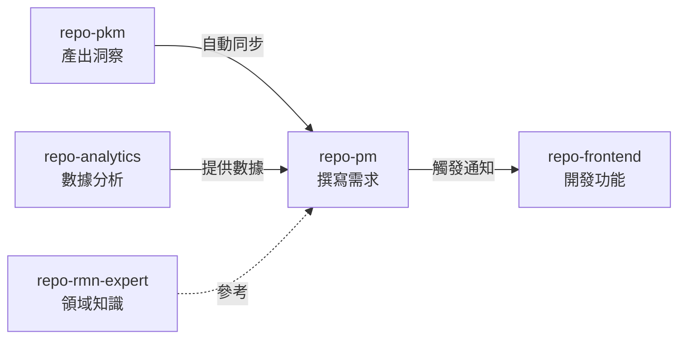

# 基於 Meta 的多 Repo AI Agent 協作架構

## 核心問題
在 AI Coding Agent 時代，如何利用 **Meta 工具**實現「Repo 即 Worker」的協作模式？

**目標：** 讓每個 Repository 成為具備獨立上下文的數位員工，透過 Meta 實現跨 Repo 的自動化協作。

## 角色定義 (每個 Repo = 一個 Agent)
- **repo-pkm**: 知識管理員 - 吸收資訊、產出洞察
- **repo-pm**: 產品經理 - 需求分析、撰寫 PRD
- **repo-frontend**: 前端工程師 - 依規格開發 UI
- **repo-analytics**: 資料工程師 - 數據處理與報告
- **repo-rmn-expert**: 領域專家 - 提供零售媒體知識

## 需要解決的三個問題

### 1. **統一管理** (Meta 原生支援)
如何在單一視圖管理 5 個獨立 Repo？
```bash
meta project add repo-pkm git@github.com:user/repo-pkm.git
meta project add repo-pm git@github.com:user/repo-pm.git
# ... 其他 Repo
meta git pull  # 統一更新所有 Repo
```

### 2. **上下文互通** (需要設計)
如何讓產出自動流轉？例如：
- `repo-pm` 產出的 `specs/feature-x.md` → 自動同步到 `repo-frontend/.context/inputs/`
- `repo-analytics` 的 `reports/data-insight.md` → 通知 `repo-pm` 參考

**核心挑戰：** 需要一套標準化的介面定義 + 自動同步機制

### 3. **AI Agent 角色感知** (需要優化)
如何讓 Cursor/Windsurf 在不同 Repo 中扮演不同角色？
- 進入 `repo-pm` → AI 知道「我是 PM，要寫 PRD」
- 進入 `repo-frontend` → AI 知道「我是開發者，要實作功能」

**需要：** 每個 Repo 的 `.cursorrules` + `.context/` 目錄結構

## 期望的工作流


## 待釐清的技術方案
1. **跨 Repo 檔案同步**：Git Hooks? Symbolic Links? 自定義 Daemon?
2. **介面定義標準**：YAML schema? 如何描述 inputs/outputs?
3. **AI Context 注入**：如何讓 AI 自動讀取其他 Repo 的產出摘要？
4. **觸發機制**：何時自動同步？commit hook? 定時任務? 手動觸發?

## 尋求建議
- Meta 工具的最佳實踐？
- 跨 Repo 自動化流轉的輕量級方案？
- 如何設計 `.context/` 目錄結構？
- 有無現成工具可參考？